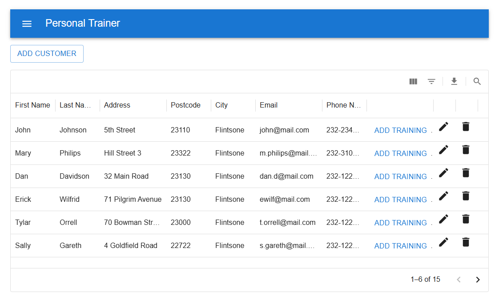
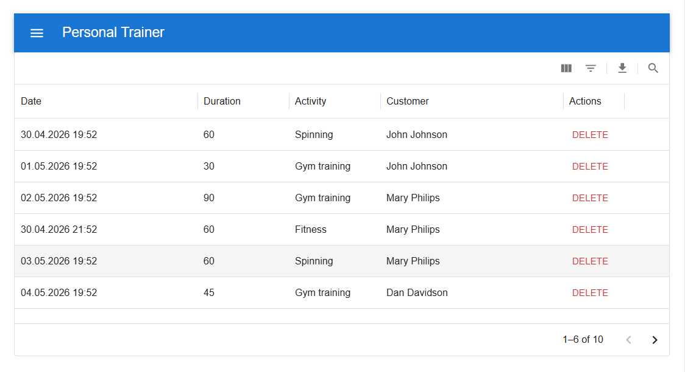
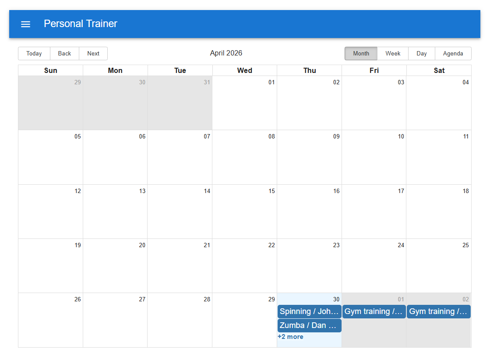
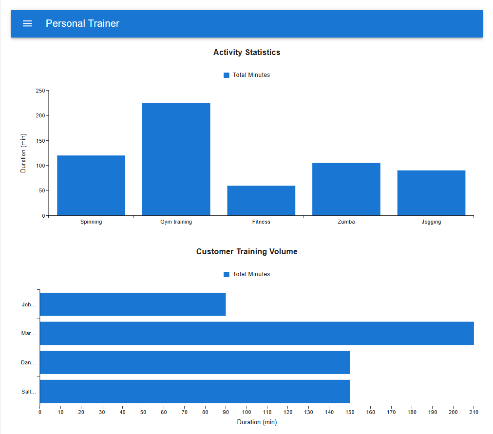

# Personal Trainer App - Frontend

A comprehensive frontend web application built for personal trainers to manage their customers, schedule training sessions, and view activity statistics. 

This project was developed as part of a frontend development course, utilizing modern React ecosystems and libraries to ensure a highly interactive and responsive user experience.

## 🚀 Live Demo
**https://lunapham10.github.io/personal-trainer-frontend-project/**

## ✨ Features

This project successfully fulfills the requirements of all 4 assignment tasks:

### 1. Customer Management (Task 1 & 2 & 3)
* **Interactive List:** View all customers in a data grid with built-in sorting and searching/filtering capabilities.
* **CRUD Operations:** Add new customers, edit existing details, and delete customers (with a safety confirmation dialog).
* **Export to CSV:** Easily download the customer list as a clean `.csv` file (excluding action buttons/unnecessary columns).

### 2. Training Management (Task 1 & 2)
* **Training Overview:** View all scheduled trainings. The list automatically fetches and displays the associated customer's full name.
* **Date Formatting:** Dates and times are neatly formatted (e.g., `dd.mm.yyyy hh:mm`) using the `dayjs` library.
* **Schedule New Sessions:** Add a new training session to a specific customer using a seamless Date & Time Picker.
* **Delete Sessions:** Remove cancelled trainings (with a safety confirmation dialog).

### 3. Interactive Calendar (Task 3)
* **Visual Scheduling:** A full-featured calendar page allowing the personal trainer to view all training sessions.
* **Multiple Views:** Navigate through Monthly, Weekly, Daily, and Agenda views. Powered by `react-big-calendar`.

### 4. Statistics Dashboard (Task 4)
* **Data Visualization:** An interactive analytics page featuring Bar Charts to visualize training data.
* **Activity Metrics:** View the total amount of minutes spent on different activities (grouped and summed using `lodash`).
* **Customer Volume:** Additional chart displaying total training durations per customer.

## 🛠️ Built With

* **Framework:** React (Bootstrapped with Vite)
* **Language:** TypeScript
* **UI Component Library:** Material-UI (MUI)
* **Routing:** React Router v6
* **Data Fetching:** Fetch API
* **Third-Party Libraries:**
  * `react-big-calendar` (For the scheduling view)
  * `@mui/x-charts` (For statistical data visualization)
  * `lodash` (For data manipulation, `groupBy`, `sumBy`)
  * `dayjs` (For precise date and time parsing/formatting)

## 💻 Getting Started (Running Locally)

To run this project on your local machine, follow these steps:

1. **Clone the repository:**
   ```bash
   git clone [https://github.com/lunapham10/personal-trainer-frontend-project.git](https://github.com/lunapham10/personal-trainer-frontend-project.git)
   ```

2. **Navigate to the project directory:**
  ```bash
   cd personal-trainer-frontend-project
   ```

3. **Install dependencies:**
  ```bash
   npm install
   ```

4. **Start the development server:**
  ```bash
   npm run dev
   ```

5. **Open your browser and visit http://localhost:5173**

## 📸 Screenshots
### Customers List



### Trainings List



### Calendar View



### Satistics Bar Charts

